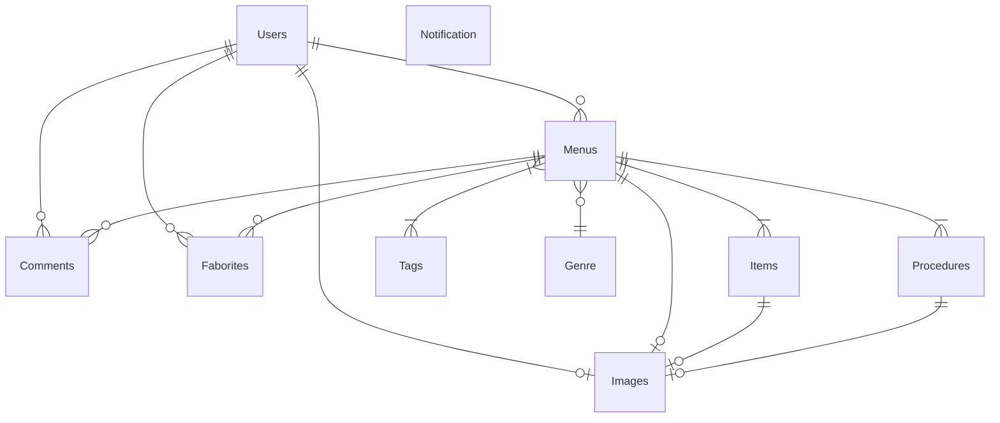

# README

## 概要

練習で作成しているwebアプリケーションです。

gitとGitHubの練習も兼ねてアップロードしています。

## ER図

中間テーブルは省略

```mermaid
erDiagram
Users ||--o{ Menus: ""
Users ||--o{ Comments: ""
Users ||--o{ Faborites: ""
Users ||--o| Images: ""

Menus ||--|{ Items: ""
Menus ||--o{ Faborites: ""
Menus }|--|{ Tags: ""
Menus ||--o| Images: ""
Menus }o--|| Genre: ""
Menus ||--|{ Procedures: ""
Menus ||--o{ Comments: ""


Items ||--o| Images: ""

Procedures ||--o| Images: ""

Notification
```

